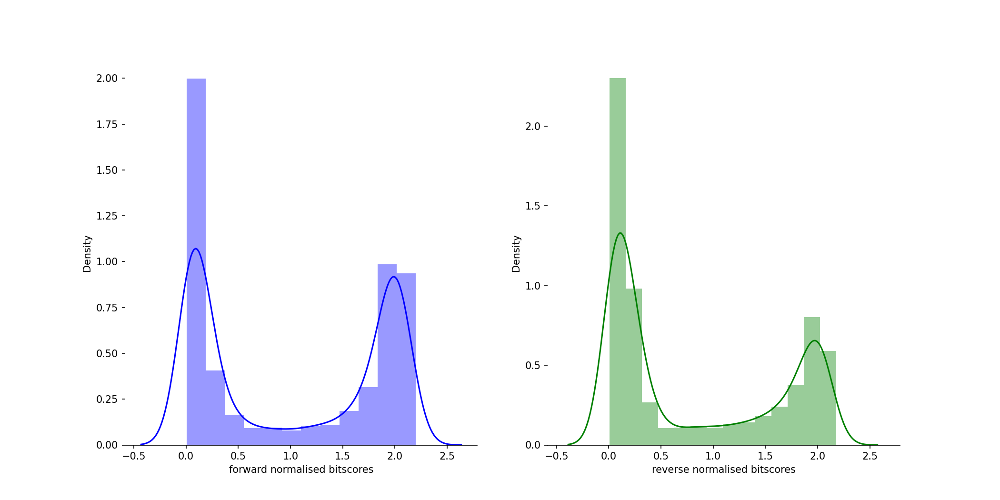
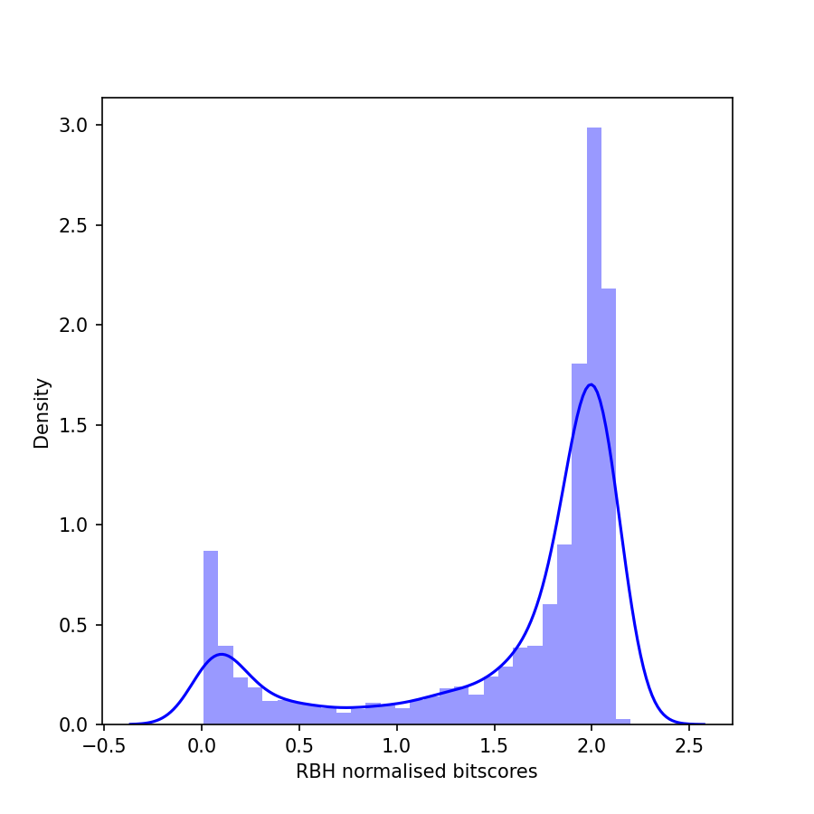
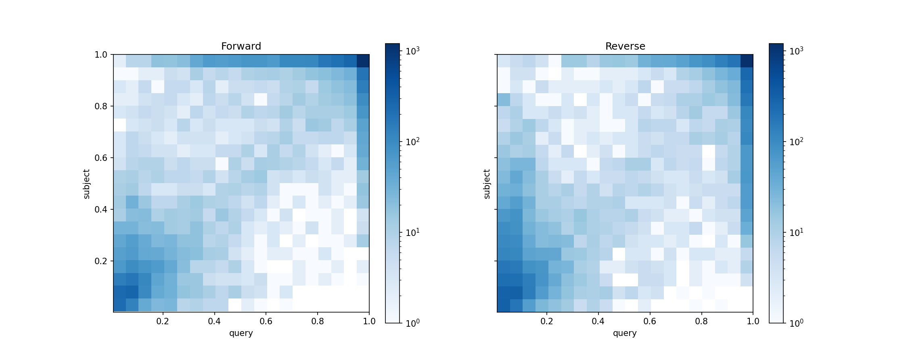
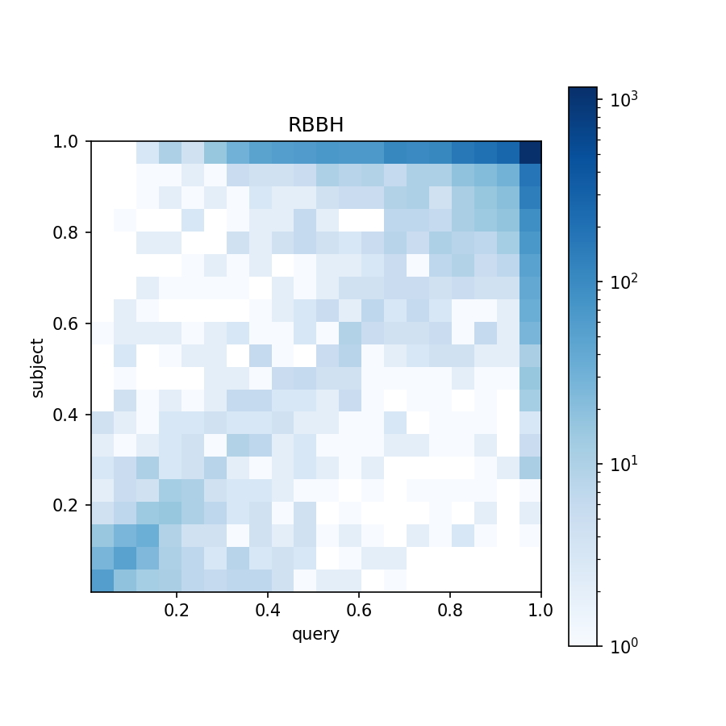

# Transfer annotations
These scripts will run liftoff, fix the problem with missing phase information and then evaluate the differences in protein and nucleotide sequence between the original gff and the liftoff transferred gff.

**The reccomended pipeline is:**
1. Run `run-and-optimise-liftoff.py`
2. Retrieve the liftoff with lowest flank number and the fewest missing features
3. AGAT CDS phase fixer, [here](https://agat.readthedocs.io/en/latest/tools/agat_sp_fix_cds_phases.html)
   ```
   agat_sp_fix_cds_frame.pl --gff infile.gff -f fasta [ -o outfile ]
   ``` 
4. Extract CDS protein code for the source and lifted gff with [AGAT](https://agat.readthedocs.io/en/latest/tools/agat_sp_extract_sequences.html)
   ```
   agat_sp_extract_sequences.pl -g infile.gff -f infile.fasta -t cds -p [-o outfile]
   ```
6. Run `gff_missing_cds_finder.py`
7. Run `gff_protein_change_finder.py`

## The scripts

### `run-liftoff.sh`

Run one instance of liftoff with default parameters and `-polish`. Add it to a loop and run it as many times as you want.

**Usage:**
```
bash run-liftoff.sh target_genome.fasta reference_genome.fasta reference_gff.gff
```
**Output:**

- Standard [Liftoff output](https://github.com/agshumate/Liftoff#output)

#
### `run-and-optimise-liftoff.py`

Automate running liftoff with different `-flank` and `-distance` parameters to get the fewest unmapped features.

**Usage:**
```
run-and-optimise-liftoff.py [-h] -gff OLD_GFF -old OLD_GENOME_FASTA -new NEW_GENOME_FASTA [-p [PLOT [PLOT ...]]]

optional arguments:
  -h, --help            show this help message and exit
  -gff OLD_GFF, --old_gff OLD_GFF
                        The original gff that needs to be transfered
  -old OLD_GENOME_FASTA, --old_genome_fasta OLD_GENOME_FASTA
                        The old genome that corresponds to the old gff
  -new NEW_GENOME_FASTA, --new_genome_fasta NEW_GENOME_FASTA
                        The new genome that you want to transfer annotations to
  -p [PLOT [PLOT ...]], --plot [PLOT [PLOT ...]]
                        If true, plots will be made for the number of unmapped features and the number of lines in the resulting gff files across each change  
                        in flank.
```
**Output:**

- Standard [Liftoff output](https://github.com/agshumate/Liftoff#output)

- `[Old_Genome_name]-to-[New_Genome_name]-UNMAPPED-FEATURE-COUNTS.csv` - summary of the number of unmapped features for each level of flank tested

- `[Old_Genome_name]-to-[New_Genome_name]-UNMAPPED-FEATURE-COUNTS.png"` - a plot of the number of unmapped features

#
### `liftoff2apollo.py`

Convert liftoff GFF3 outputs into Apollo friendly GFF3 files.
Liftoff adds several fields to the gff attributes column that are unused by Apollo.

This script will remove added attributes and convert the header to Apollo format which uses this:
https://github.com/The-Sequence-Ontology/Specifications/blob/master/gff3.md

The removed attributes are as follows:
['coverage', 'sequence_ID', 'valid_ORFs', 'extra_copy_number', 'copy_num_ID']

*This removes metadata put into the gff by liftoff by force. If you want to make it apollo compliant and keep most of the liftoff metadata use [this](https://agat.readthedocs.io/en/latest/tools/agat_sp_webApollo_compliant.html)*

**Usage:**
```
liftoff2apollo.py [-h] -l LIFTOFF_GFF -f GENOME_FASTA

optional arguments:
  -h, --help            show this help message and exit
  -l LIFTOFF_GFF, --liftoff_gff LIFTOFF_GFF
                        A gff file produced by liftoff
  -f GENOME_FASTA, --genome_fasta GENOME_FASTA
                        A genome fasta file that corresponds to the liftoff gff
```
**Output:**
- `liftoff-gff-name_APOLLO.gff` - A gff format annotation file

#
### `gff-phase-finder.py`
Calculates GFF phase information for CDS which lack it. This was made for liftoff gff outputs which lack this information.
NOTE! GFF phase is not the same as reading frame! Please see the [Sequence Ontology documentation](https://github.com/The-Sequence-Ontology/Specifications/blob/master/gff3.md)

*This script is relatively slow and does not deal with instances where the start phase is not 0. I have since found a better piece of code to do this: [AGAT](https://agat.readthedocs.io/en/latest/tools/agat_sp_fix_cds_phases.html)*

**Usage:**
```
gff-phase-finder.py [-h] -gff LIFTOFF_GFF

optional arguments:
  -h, --help            show this help message and exit
  -gff LIFTOFF_GFF, --liftoff_gff LIFTOFF_GFF
                        The gff without phase information (made for liftoff)
```
**Output:**

- `your-gff-name-PHASE-CORRECTED.gff` - A gff format annotation file

#
### `gff_indexer.py`

Forcefully adds a numbered index to the attributes of each row in a gff to act as a unique identifier just in case there isn't one

**Usage:**
```
gff_indexer.py [-h] -g GFF

optional arguments:
  -h, --help         show this help message and exit
  -g GFF, --gff GFF  The original gff for the genome that needs annotating
```
**Output:**

- `your-gff-name_indexed.gff` - A gff format annotation file

#
### `gff_missing_cds_finder.py`
Examine the similarity of an old and new gff for one genome.

**Usage:**
```
gff_missing_cds_finder.py [-h] -sg SOURCE_GFF -lg LIFTED_GFF -o OUTPUT

optional arguments:
  -h, --help            show this help message and exit
  -sg SOURCE_GFF, --source_gff SOURCE_GFF
                        The source gff for the genome
  -lg LIFTED_GFF, --lifted_gff LIFTED_GFF
                        The lifted gff for the genome to compare against the original one
  -o OUTPUT, --output OUTPUT
                        The name prefix to give your outputs
```
**Output:**
- `your-name-missing-cds-list.csv` - a list of transcript IDS that have a missing start, middle or end CDS

#
### `gff_protein_change_finder.py`
A script to annotate a gff with transfer vailidty information and protein identity matches 

The output will report changes in the nucleotide and protein sequence

**Usage:** 

```
gff_protein_change_finder.py [-h] -lcds LIFTED_CDS_AA -scds SOURCE_CDS_AA -nf NEW_FASTA -sf SOURCE_FASTA -lg LIFTED_GFF -sg SOURCE_GFF -m MISSING_CDS_LISTS -o OUTPUT

optional arguments:
  -h, --help            show this help message and exit
  -lcds LIFTED_CDS_AA, --lifted_cds_aa LIFTED_CDS_AA
                        the new CDS proteins retrieved with AGAT
  -scds SOURCE_CDS_AA, --source_cds_aa SOURCE_CDS_AA
                        the source CDS proteins retrieved with AGAT
  -nf NEW_FASTA, --new_fasta NEW_FASTA
                        the new genome fasta associated with the lifted gff
  -sf SOURCE_FASTA, --source_fasta SOURCE_FASTA
                        the source genome fasta associated with the source gff and lifted gff
  -lg LIFTED_GFF, --lifted_gff LIFTED_GFF
                        the gff associated with the new genome produced by liftoff and phase fixed with AGAT to be annotated with information
  -sg SOURCE_GFF, --source_gff SOURCE_GFF
                        the gff associated with the source genome and lifted gff
  -m MISSING_CDS_LISTS, --missing_cds_lists MISSING_CDS_LISTS
                        csv of missing cds with the headings 'missing_start', 'missing_middle', 'missing_end'
  -o OUTPUT, --output OUTPUT
                        output names
```
**Output:**
- `your-output-name_changes_marked.gff` - gff with the added attributes for 'has_missing_cds', 'has_internal_stops','valid_transfer','proteins_match_source'
- `your-output-name_protein-change-stats.csv` - a csv containing a summary of changes in CDS between source and lifted genes
- `your-output-name_CDS-summary.png` - A bar chart of the number of valid transfers and whether or not their protein sequence matches
- `your-output-name_ncRNA-pseudogene-summary.png` - A bar chart of the number and types of non-coding genes coloured by the validity of the transfer
- `your-output-name_CDS-failure-summary.png` - A bar chart of the failed CDS transfers and what is wrong with them

#
### `find-reciprocal-best-hits.py` 
Calculate reciprocal best hits and make some nice histograms and density plots
Based on code from [here](https://widdowquinn.github.io/2018-03-06-ibioic/02-sequence_databases/05-blast_for_rbh.html)

**Usage:**
```
find-reciprocal-best-hits.py [-h] -s1 QUERY_AA -s2 SUBJECT_AA -o OUTPUT

optional arguments:
  -h, --help    show this help message and exit
  -s1 QUERY_AA, --query_aa QUERY_AA   
                one set of aa sequence
  -s2 SUBJECT_AA, --subject_aa SUBJECT_AA    
                second set of aa sequence
  -o OUTPUT, --output OUTPUT    
                Name for outputs
```
**Output:**
Blast results for forward and reverse reads:

-`outputName-fwd-results.tab`
-`outputName-rev-results.tab`

Reciprocal best hits:

-`Cposadasi-test-rbbh.csv`

- histograms of normalised bitscores for forward, reverse and reciprocal reads:



- 2D density plots of normalised bitscores for forward, reverse and reciprocal reads:


